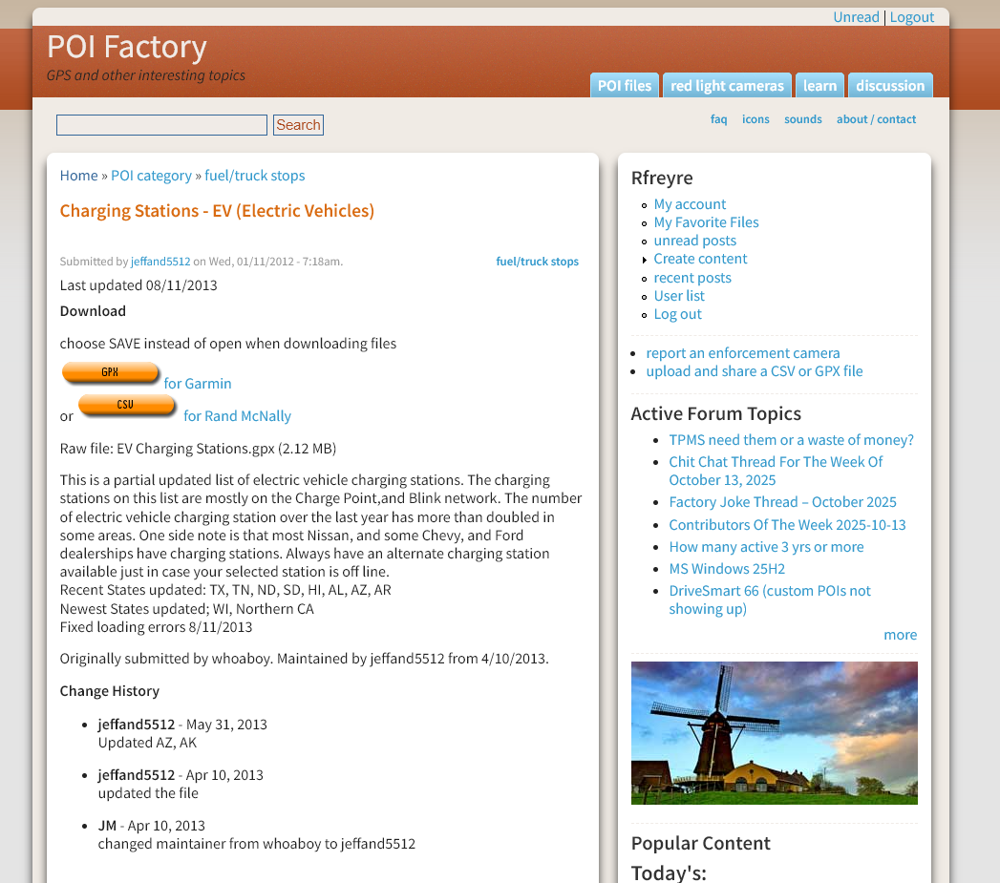
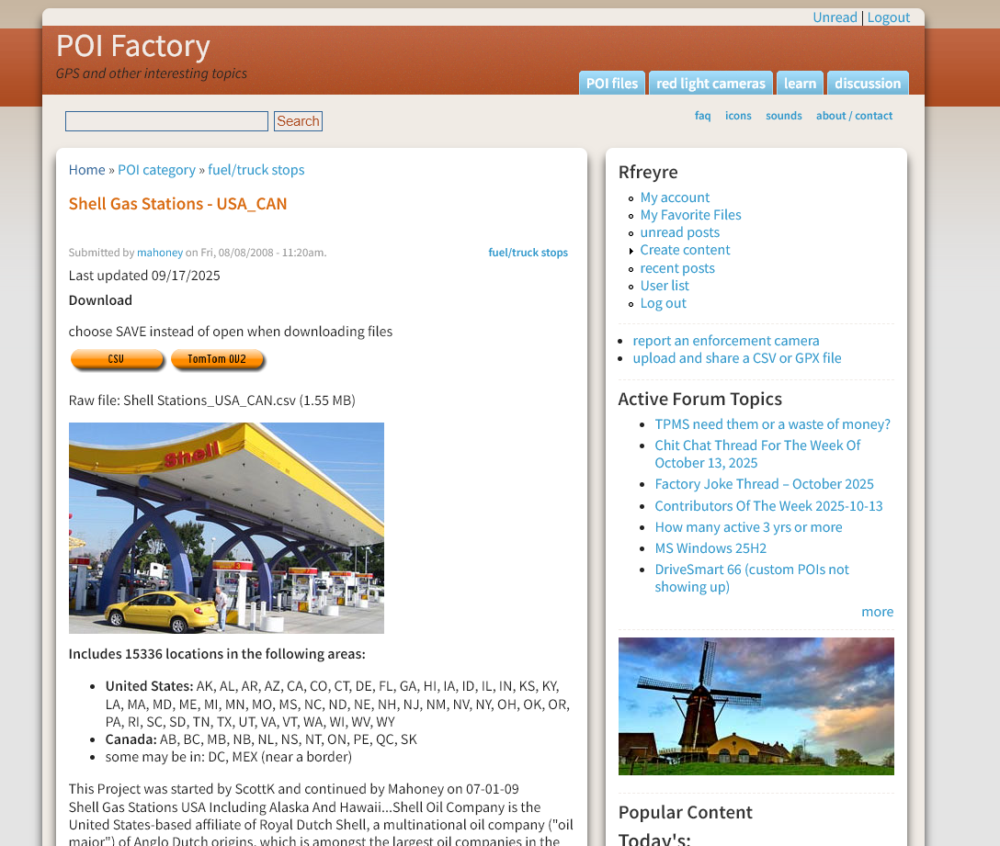

# Week 7 – Google Heat Map - Raúl Freyre

## Overview
I built a dual heatmap in Google Maps to compare the spatial distribution of two energy infrastructures across the U.S.:
1) **EV Charging Stations**, and
2) **Shell Gas Stations**.

The goal was to visualize regional patterns and observe where both networks coexist.

---

## Methodology (what I did)
1. Used the instructor’s HTML template
   I followed the googleHeatMap-Students.html structure shown in the walkthrough video. I kept the floating panel with two buttons and inserted my two JavaScript arrays (objects with {name, lat, lon}) exactly in the format demonstrated by the instructor.

2. Created a Google Maps API Key
   I registered a new project in Google Cloud, enabled Maps JavaScript API and the Visualization Library, and added a billing method. I expected no charges for this academic use case. Then I embedded my API key in the HTML.

3. Downloaded datasets from POI Factory
   I created an account on POI Factory and downloaded:
   - **EV Charging Stations (U.S.)**
   - **Shell Gas Stations (U.S.)**

   Source screenshots:
   - 
   - 

4. Why EV vs Shell (scope and logic)
   I initially considered downloading all U.S. gas stations, but that proved too broad and hard to curate for this assignment. I chose Shell because it is a large, widely distributed brand. This gave me a coherent comparison: fossil fuel infrastructure (Shell) vs electric infrastructure (EV), and let me examine co-location patterns.

5. Data structure and cleaning
   - Both CSVs used Column A = longitude, Column B = latitude, Column C = name.
   - I constructed arrays of objects using the professor’s syntax:
     ```js
     {name:"...", lat:##.######, lon:-##.######},
     ```
   - In the EV CSV, many names were very long. To keep the source code readable, I replaced the EV names with short, sequential labels:
     **EV Charging Station 1**, **EV Charging Station 2**, …
     (Coordinates remained unchanged.)
   - For Shell, I kept the original names because they were already concise.

6. Visualization setup
   - I centered the map on the continental U.S. (zoom: 4, center: { lat: 39.8283, lng: -98.5795 }).
   - I created two HeatmapLayer instances (EV and Shell) and added two buttons to toggle each layer independently.
   - At the national scale, I observed that many areas with Shell stations also show EV charging stations, suggesting coexistence and an ongoing energy transition.

---


## How to run

### A) Locally (VS Code)
1. Open the project folder in VS Code.
2. Install the Live Server extension (if needed).
3. Right‑click the HTML file → Open with Live Server.
4. Wait for the initial load (it can take time due to the number of points).
5. Toggle layers using the buttons in the top panel.
---

## Notes
- Google’s HeatmapLayer shows a deprecation warning but still works for academic purposes.
- Because of the large number of points, the first load can be slow. If needed, I can move datasets to external .js files later to optimize loading.

---

## Conclusion
Comparing EV vs Shell highlights energy infrastructure patterns across the U.S. Qualitatively, I observed metropolitan areas and transport corridors with high concentrations of both EV charging stations and Shell gas stations, indicating coexistence and the transition toward electric mobility.